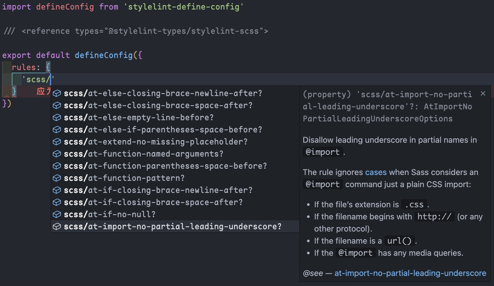

# @stylelint-types/stylelint-scss

TypeScript definitions for [stylelint-define-config](https://github.com/stylelint-types/stylelint-define-config).

## Install

```sh
npm i -D @stylelint-types/stylelint-scss
# or
pnpm add -D @stylelint-types/stylelint-scss
# or
yarn add -D @stylelint-types/stylelint-scss
```

## Usage

```js
// @ts-check
const defineConfig = require('stylelint-define-config')

/// <reference types="@stylelint-types/stylelint-scss">

module.exports = defineConfig({
  rules: {
    // ...rules
  }
})
```



## Credits

- [@stylelint-types](https://github.com/stylelint-types)
- [@pengzhanbo](https://github.com/pengzhanbo)

## LICENSE

(MIT)[./LICENSE]
